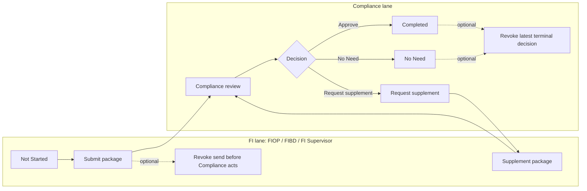
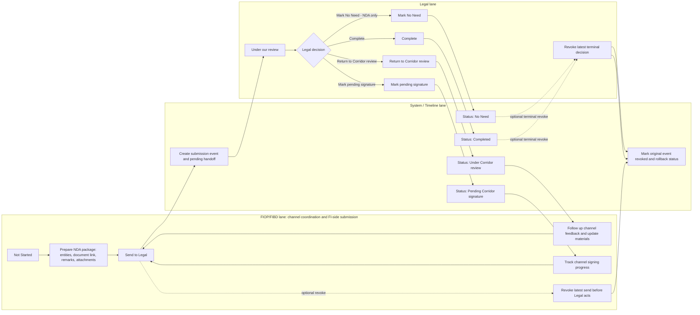
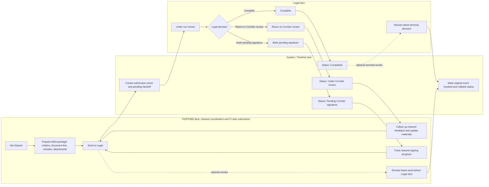
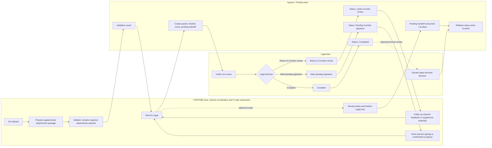
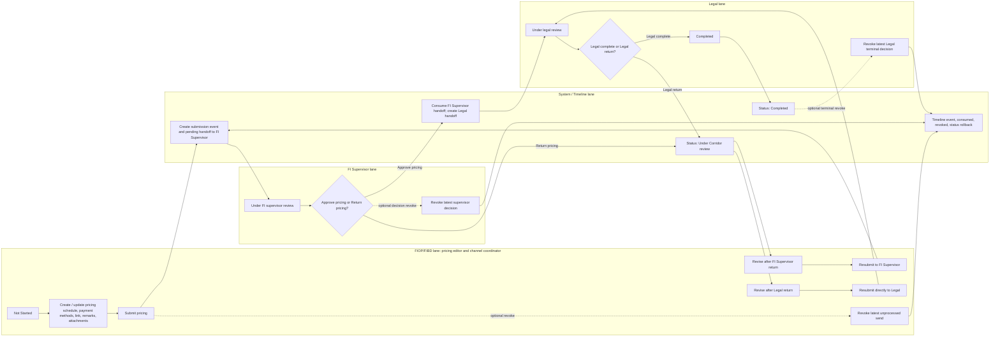

# FI workflow swimlane diagram prompts

本文档用于沉淀 FI 相关审批流的泳道图绘制口径，以及用于 `image-2` 或其他 AI 绘图工具生成 BPMN-lite 跨职能泳道流程图的提示词。

推荐图形类型：**BPMN-lite cross-functional swimlane diagram**。按系统内角色分泳道，用实线箭头表示 handoff，用虚线箭头表示 revoke / rollback，用菱形表示审批或分支决策，用圆角矩形表示状态或动作。

## 1. 图形选择

- **KYC**：双轨并行泳道图。`WooshPay onboarding` 与 `Corridor onboarding` 是两条独立 track，状态互不覆盖。
- **NDA**：三泳道图。泳道为 `FIOP/FIBD`、`Legal`、`System / Timeline`。NDA 支持 `No Need`。
- **MSA**：三泳道图。泳道为 `FIOP/FIBD`、`Legal`、`System / Timeline`。MSA 不支持 `No Need`。
- **Other Attachments**：三泳道图。泳道为 `FIOP/FIBD`、`Legal`、`System / Timeline`。突出 remarks 必填、attachments 可选。
- **Pricing Schedule**：四泳道图。泳道为 `FIOP/FIBD`、`FI Supervisor`、`Legal`、`System / Timeline`。保留 FI Supervisor 审批阶段。

重要口径：

- 不要创建 `External Corridor lane` 或 `External Party lane`。
- 外部渠道不作为系统操作角色、权限主体或 handoff 接收方。
- 状态文案 `Under Corridor review`、`Pending Corridor signature` 可以保留，但它们只表示业务进度。
- 渠道反馈、签署进度、补充材料均由 `FIOP/FIBD` 作为中转人在系统内记录。

## 2. 角色流转

### KYC

- FI 角色包含 `FIOP`、`FIBD`、`FI Supervisor`，可提交首版材料或补件。
- Compliance 审核后可选择 `Completed`、`No Need`，或退回 FI 补件。
- FI 在 Compliance 未处理前可撤回本次提交；Compliance 对最新终态决定也可撤回。
- 两条 track 独立流转：
  - `WooshPay onboarding`: FI 提交后进入 `WooshPay preparation`；Compliance 退回后进入 `Corridor reviewing`。
  - `Corridor onboarding`: FI 提交后进入 `WooshPay reviewing`；Compliance 退回后进入 `Corridor preparation`。



### NDA

- `FIOP/FIBD` 维护 NDA package，并作为外部渠道与我方 `Legal` 的交接中转人。
- `FIOP/FIBD` 提交后状态进入 `Under our review`，系统记录 latest submission、pending handoff、timeline event。
- `Legal` 可选择 `Return to Corridor review`、`Mark pending signature`、`Complete`、`Mark No Need`。
- `Under Corridor review` 表示 `FIOP/FIBD` 跟进渠道反馈并更新材料，不代表外部渠道操作系统。
- `Pending Corridor signature` 表示 `FIOP/FIBD` 跟进渠道签署进度。
- `FIOP/FIBD` 可在 Legal 未处理前撤回最新提交；Legal 最新终态决定可由同一 Legal actor 撤回。



### MSA

- `FIOP/FIBD` 维护 MSA package，并作为外部渠道与我方 `Legal` 的交接中转人。
- `FIOP/FIBD` 提交后状态进入 `Under our review`，系统记录 submission、pending handoff、timeline。
- `Legal` 可选择 `Return to Corridor review`、`Mark pending signature`、`Complete`。
- MSA 不支持 `No Need`，图中不得出现 `No Need` 分支。
- `Under Corridor review`、`Pending Corridor signature` 都是业务进度，由 `FIOP/FIBD` 跟进渠道反馈或签署进度。



### Other Attachments

- `FIOP/FIBD` 维护 supplemental attachments package，并作为外部渠道与我方 `Legal` 的交接中转人。
- `remarks` 必填，`attachments` 可选；如附件仍在上传或上传失败，不允许提交。
- `FIOP/FIBD` 提交后状态进入 `Under our review`，系统记录 latest packet、pending handoff、timeline event。
- `Legal` 可选择 `Return to Corridor review`、`Mark pending signature`、`Complete`。
- Other Attachments 不支持 `No Need`。



### Pricing Schedule

- `FIOP/FIBD` 创建或更新 pricing schedule、payment methods、document link、remarks、attachments。
- 首次提交进入 `Under FI supervisor review`，系统创建 pending handoff to `FI Supervisor`。
- `FI Supervisor` 可批准进入 Legal `Under legal review`，也可退回，状态为 `Under Corridor review`。
- `Legal` 可完成，状态为 `Completed`；也可退回，状态为 `Under Corridor review`。
- `FI Supervisor` 退回后的再次提交回到 `Under FI supervisor review`。
- `Legal` 退回后的再次提交直接回到 `Under legal review`，不再经过 `FI Supervisor`。
- `Under Corridor review` 表示 `FIOP/FIBD` 修改 pricing 并跟进渠道反馈，不代表外部渠道操作系统。



## 3. image-2 prompts

### KYC

```text
Use case: infographic-diagram
Asset type: 16:9 business workflow diagram
Create a clean cross-functional swimlane flowchart for KYC onboarding. Use two parallel tracks: "WooshPay onboarding" and "Corridor onboarding". Use lanes: "FI: FIOP / FIBD / FI Supervisor" and "Compliance". Show flow: Not Started -> FI submits package -> Compliance review -> decision diamond: Approve / No Need / Request supplement. Approve goes to Completed, No Need goes to No Need, Request supplement goes back to FI supplement, then FI resubmits to Compliance. Add small note: "Two tracks are independent". Use modern enterprise UI style, white background, blue/orange/green status colors, crisp arrows, readable text, no decorative illustrations, no watermark.
```

### NDA

```text
Create a clean 16:9 BPMN-lite swimlane diagram titled "NDA Workflow".

Use exactly two lanes:
1. FI: FIOP / FIBD / FI Supervisor
2. Legal

Do not create any External Corridor, External Party, Fund, Treasury, or System lane.

Flow:
Not Started -> FI sends NDA package -> Under our review -> Legal decision.

Legal decision branches:
1. Return to Corridor review -> Under Corridor review -> FI follows up channel feedback and updates materials -> FI resubmits package -> Under our review.
2. Mark pending signature -> Pending Corridor signature -> FI confirms both our signature and corridor signature -> FI notifies Legal -> Legal confirms signing result -> Completed.
3. If corridor requests changes after signature started -> FI updates NDA package -> FI resubmits package -> Under our review.
4. Complete -> Completed.
5. Mark No Need -> No Need.

Important notes on the diagram:
- "No Need is NDA only."
- "Completion is set by Legal after FI confirms both signatures."
- "If corridor requests changes after our signature, treat the prior signature round as void and restart Legal review."
- "Corridor is business progress only; FI records channel feedback."

Visual style: white background, black lane borders, rounded rectangles, diamond decision node, blue review states, orange returned/waiting states, green Completed, gray No Need, crisp left-to-right arrows.
```

### MSA

```text
Create a clean 16:9 BPMN-lite swimlane diagram titled "MSA Workflow".

Use exactly two lanes:
1. FI: FIOP / FIBD / FI Supervisor
2. Legal

Do not create any External Corridor, External Party, Fund, Treasury, or System lane.
Do not include No Need anywhere.

Flow:
Not Started -> FI sends MSA package -> Under our review -> Legal decision.

Legal decision branches:
1. Return to Corridor review -> Under Corridor review -> FI follows up channel feedback and updates materials -> FI resubmits package -> Under our review.
2. Mark pending signature -> Pending Corridor signature -> FI tracks channel signing progress -> FI resubmits package if updated -> Under our review.
3. Complete -> Completed.

Important note on the diagram:
- "Corridor is business progress only; FI records channel feedback."

Visual style: white background, black lane borders, rounded rectangles, diamond decision node, blue review states, orange returned/waiting states, green Completed, crisp left-to-right arrows.
```

### Other Attachments

```text
Create a clean 16:9 BPMN-lite swimlane diagram titled "Other Attachments Workflow".

Use exactly two lanes:
1. FI: FIOP / FIBD / FI Supervisor
2. Legal

Do not create any External Corridor, External Party, Fund, Treasury, or System lane.
Do not include No Need anywhere.

Flow:
Not Started -> FI prepares supplemental attachments package -> Validate remarks required, attachments optional -> FI sends package -> Under our review -> Legal decision.

Legal decision branches:
1. Return to Corridor review -> Under Corridor review -> FI supplements materials or follows up feedback -> FI resubmits package -> Under our review.
2. Mark pending signature -> Pending Corridor signature -> FI tracks confirmation or signing progress -> FI resubmits package if updated -> Under our review.
3. Complete -> Completed.

Important notes on the diagram:
- "Remarks required; attachments optional."
- "Corridor is business progress only; FI records channel feedback."

Visual style: white background, black lane borders, rounded rectangles, diamond decision node, blue review states, orange returned/waiting states, green Completed, crisp left-to-right arrows.
```

### Pricing Schedule

```text
Create a clean 16:9 BPMN-lite swimlane diagram titled "Pricing Schedule Workflow".

Use exactly three lanes:
1. FI: FIOP / FIBD / FI Supervisor
2. FI Supervisor
3. Legal

Do not create any External Corridor, External Party, Fund, Treasury, or System lane.
Do not include No Need anywhere.

Flow:
Not Started -> FI creates or updates pricing schedule, payment methods, document link, remarks, and attachments -> Submit pricing -> Under FI supervisor review -> FI Supervisor decision.

FI Supervisor decision branches:
1. Approve pricing -> Under legal review -> Legal decision.
2. Return pricing -> Under Corridor review -> FI revises pricing and follows up channel feedback -> FI resubmits pricing -> Under FI supervisor review.

Legal decision branches:
1. Legal complete -> Completed.
2. Legal return -> Under Corridor review -> FI revises pricing and updates materials -> FI resubmits returned pricing directly to Legal -> Under legal review.

Important notes on the diagram:
- "FI Supervisor return goes back to FI Supervisor review."
- "Legal return goes directly back to Legal review."
- "Corridor is business progress only; FI records channel feedback."

Visual style: white background, black lane borders, rounded rectangles, diamond decision nodes, blue review states, orange returned states, green Completed, crisp left-to-right arrows.
```

## 4. 验收检查

- 法务卡片的四个提示词都不能生成外部渠道泳道。
- 每张图都必须让技术人员看清 actor、status、handoff、timeline、revoke。
- `NDA` 包含 `No Need`；`MSA`、`Other Attachments`、`Pricing Schedule` 不包含 `No Need`。
- `Pricing Schedule` 必须明确区分 FI Supervisor 退回和 Legal 退回后的再次提交路径。
- 所有图都保留 `Under Corridor review` / `Pending Corridor signature` 状态文案，并解释为 `FIOP/FIBD` 跟进的业务进度。

## 5. Source references

- KYC track and status logic: `src/constants/onboarding.ts`
- NDA / MSA / Other Attachments legal status logic: `src/utils/workflowStatus.ts`
- Pricing schedule status and handoff logic: `src/constants/initialData.ts`
- Role access and assignment scope: `src/stores/app.ts`
- Legal card requirements: `docs/backend/fi-legal-card-workflow.md`
